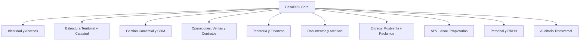

# 00 — Ficha Maestra del Sistema CasaPRO

## 1. Identificación y Propósito General

- **Nombre del Sistema:** CasaPRO
- **Propósito:** Plataforma integral ERP / CRM / Inmobiliario de alta fidelidad para la gestión corporativa, comercial, financiera, catastral, documental, operativa y de postventa en desarrollos urbanos e inmobiliarios.
- **Ruta Base Local:** `D:\laragon\www\app.casa-pro`
- **Dominios Locales:** `https://localhost/app.casa-pro/` | `https://app.casa-pro.test/`
- **Plantilla Oficial de Referencia (Read-Only):** `admin-dashboard\alina\template\`
- **Plantilla Base Obligatoria:** `admin-dashboard\alina\template\blank.html`
- **Documentación Alina (Read-Only):** `admin-dashboard\documentation\index.html`

---

## 2. Los Grandes Ejes del Dominio (Matriz Bonifacio)

CasaPRO implementa la arquitectura integral de negocio inmobiliario estructurada en las siguientes áreas de dominio:

### 2.1. Multiempresa y Multisede con Scopes
- Capacidad nativa de operar múltiples empresas o personas jurídicas operadoras.
- Cada registro operativo (proyectos, contratos, caja, asientos) pertenece a un ámbito (`empresa_id`).
- Scopes de acceso jerárquicos:
  1. `GLOBAL`: Acceso irrestricto transversal a todas las empresas (Superadministradores / Auditoría Corporativa).
  2. `EMPRESA`: Restringido a una o varias empresas específicas.
  3. `PROYECTO`: Restringido a proyectos determinados dentro de una empresa.
  4. `SECTOR`: Restringido a sectores específicos dentro de un proyecto.

### 2.2. Núcleo de Identidad Desacoplada: Matriz Persona
- **Principio Fundamental:** `Persona != Cliente != Personal != Usuario`.
- Una **Persona** (natural o jurídica) es el registro raíz y único de identidad civil/tributaria (DNI, RUC, CE, Pasaporte, Nombres, Razón Social, Contactos).
- Una misma Persona puede asumir simultáneamente múltiples roles sin duplicar sus datos:
  - Ser **Cliente** en uno o más proyectos.
  - Ser **Personal** (colaborador, asesor, cajero, supervisor) en una o más empresas.
  - Ser **Usuario** del sistema con credenciales de acceso al dashboard.
  - Ser **Propietario** con título formal.
  - Ser miembro de una directiva **APV**.

### 2.3. Estructura Catastral, Territorial y GIS
- **Proyectos Inmobiliarios:** Identificación, geolocalización, zonificación, planos generales.
- **Sectores / Etapas:** Subdivisiones operativas y de lanzamiento por fases.
- **Manzanas:** Agrupaciones físicas de lotes.
- **Lotes / Inmuebles:** Unidades vendibles individuales con metraje, linderos, precio base, estado actual (`Disponible`, `Bloqueado`, `Cotizado`, `Reservado`, `Vendido`, `En Entrega`, `Entregado`).
- **Módulo GIS Interactivo:** Integración basada en Leaflet (incluido nativamente en Alina) para visualización planimétrica con capas interactivas, polígonos de manzanas y lotes clickeables con estado en tiempo real.

### 2.4. Gestión Comercial y CRM Inmobiliario
- **Prospectos (Leads):** Captación multicanal (visitas a caseta, ferias, web, pauta publicitaria).
- **Registro de Visitas:** Bitácora presencial de inspección de terreno con asesor asignado.
- **Cotizaciones:** Simulación de precios, cálculo de descuentos, planes de financiamiento con fecha de caducidad.
- **Compromisos y Reservas:** Bloqueo temporal de lotes contra pago de arras/separación con plazo perentorio.

### 2.5. Ventas, Contratación y Financiamiento
- **Venta Formal:** Cierre de contrato de compraventa con vinculación de titular(es) y aval(es).
- **Financiamiento Directo:**
  - Definición de cuota inicial, cuotas mensuales, tasa de interés, amortización francesa o alemana.
  - Generación automática del cronograma de cuotas con desglose de capital, interés y mora.
- **Venta Contado:** Liquidación en pago único o parcialidades pactadas.

### 2.6. Tesorería, Cajas y Apertura Financiera
- **Cajas Físicas y Cuentas Bancarias:** Estructura de cuentas recaudadoras por empresa.
- **Apertura y Cierre de Caja:** Control estricto de arqueo de caja diario por usuario cajero.
- **Emisión de Recibos y Comprobantes:** Registro de depósitos, transferencias, efectivo y validación de operaciones bancarias.
- **Gestión de Cobranzas:** Seguimiento de cuotas por vencer, vencidas, cálculo automatizado de penalidades e intereses moratorios, generación de estados de cuenta individuales.

### 2.7. Adquisiciones y Gestión Patrimonial
- **Adquisición de Predios Matrices:** Compra de terrenos mayores, escrituración, costos notariales y registrales.
- **Patrimonio y Costos del Proyecto:** Costeo directo de habilitación urbana, pistas, veredas, redes de agua y luz.

### 2.8. Gestión Documental y Archivos
- Almacenamiento seguro fuera de la raíz pública (`storage/uploads/`).
- Generación de contratos, adendas, pagarés, cronogramas y actas en PDF a partir de plantillas formales.
- Historial de versiones y expediente digital por cliente y por lote.

### 2.9. Entrega, Postventa y Reclamaciones
- **Entrega Formal:** Verificación de pago total o cumplimiento de condiciones para posesión; acta de entrega con firma física/digital e inspección fotográfica.
- **Postventa:** Tickets de atención por vicios ocultos, mantenimiento o incidencias de habilitación urbana con SLA de respuesta.
- **Libro de Reclamaciones:** Libro digital normativo con código único de reclamación y seguimiento de respuesta formal.

### 2.10. APV (Asociación de Propietarios de Vivienda) Desacoplada
- Módulo complementario para la gestión social y vecinal: empadronamiento de socios, juntas directivas, cuotas de mantenimiento vecinal, actas de asamblea y vigilancia.

### 2.11. Control de Asistencia y Personal
- Registro de marcaciones, horarios de caseta/oficina, comisiones por ventas vinculadas a asesores cerradores.

### 2.12. Menú Dinámico Multinivel
- Menú de 3 niveles estructurado en Base de Datos:
  - Nivel 1: Módulo / Agrupador Principal (e.g., Catastro, Comercial, Finanzas).
  - Nivel 2: Submódulo / Entidad (e.g., Proyectos, Cotizaciones, Cajas).
  - Nivel 3: Pantalla / Acción de Navegación (e.g., Listado de Lotes, Arqueo Diario).
- Visibilidad controlada estrictamente por permisos del usuario autenticado.

---

## 3. Principios Rectores del Sistema

1. **Inmutabilidad Financiera:** Ninguna transacción de pago, cuota cobrada o arqueo de caja se elimina físicamente. Toda corrección se realiza vía anulación justificada con estorno contable y auditoría completa.
2. **Auditoría Transversal:** Cada inserción, actualización o cambio de estado registra actor, IP, timestamp, valor previo y valor nuevo en formato JSON estructurado.
3. **Integridad Referencial Absoluta:** Base de datos con claves foráneas estrictas y restricciones `ON DELETE RESTRICT` en registros vinculados a operaciones financieras o contractuales.
4. **Fidelidad al Sistema de Diseño Alina:** Ningún componente visual se inventa; toda pantalla se construye ensamblando componentes físicos existentes en Alina.
