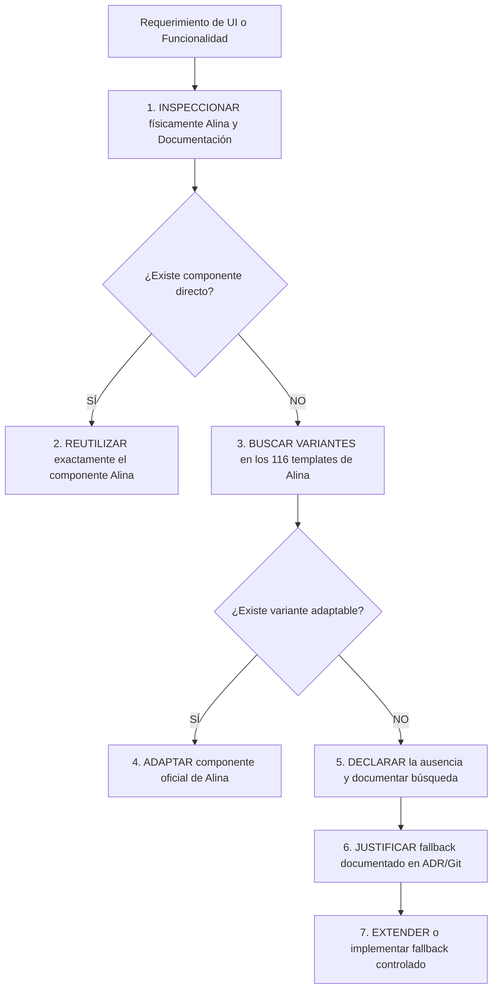

# 01 — Gobernanza de Proyecto y Reglas de Desarrollo

## 1. Declaración de Autoridad y Jerarquía Documental

1. **Prevalencia del Repositorio Local:** Los archivos físicos contenidos en `D:\laragon\www\app.casa-pro`, en especial la plantilla `admin-dashboard\alina\template` y su documentación `admin-dashboard\documentation`, constituyen la **única fuente de verdad** estética y de componentes UI. El conocimiento interno o memoria general de cualquier IA o desarrollador queda subordinado a los archivos locales.
2. **Inmutabilidad de la Plantilla Original:** La carpeta `admin-dashboard/` es una referencia técnica de **solo lectura**. Queda terminantemente prohibido alterar, editar, renombrar o mover archivos dentro de `admin-dashboard/`. El código del sistema CasaPRO se desarrolla en la raíz del proyecto (`app/`, `public/`, `config/`, etc.), copiando o adaptando los recursos necesarios hacia la estructura productiva.

---

## 2. La Regla Anti-Invención

Ningún agente o desarrollador tiene autorización para generar código HTML, estilos CSS, plugins JS o librerías de terceros basándose en suposiciones, tendencias genéricas de la web o hábitos de otros frameworks.

El flujo de trabajo es estricto e inviolable:



### Protocolo de Evidencia para Fallbacks:
Si un requerimiento legítimo de CasaPRO no tiene un componente equivalente en Alina (por ejemplo, validación declarativa avanzada sin jQuery tipo PristineJS):
1. **Inspeccionar:** Buscar en `admin-dashboard/alina/template/*.html` y `admin-dashboard/alina/assets/vendor/`.
2. **Declarar:** Documentar explícitamente qué archivos se inspeccionaron y qué se encontró.
3. **Justificar:** Explicar técnicamente por qué las opciones nativas de Alina son insuficientes para el caso de uso.
4. **Registrar ADR:** Crear o referenciar la Decisión Arquitectónica formal antes de introducir la librería externa.

---

## 3. Estructura de Roles y Agentes Especializados

Para garantizar la integridad y evitar modificaciones simultáneas contradictorias, el desarrollo se organiza en responsabilidades funcionales bien delimitadas.

```
AGENTE ORQUESTADOR / ARQUITECTO
│
├── Agente de Gobernanza (Control de normas, ADRs y checklist)
├── Agente de Arquitectura (Patrones de diseño, MVC, rutas y flujo)
├── Agente de Base de Datos (Esquemas, migraciones, integridad y tipos)
├── Agente Backend PHP (Servicios, repositorios, controladores y validación)
├── Agente Frontend / Alina (Inspección física de plantillas, ensamble UI, DataTables)
├── Agente Seguridad / RBAC (Autenticación, CSRF, permisos, scopes y sanitización)
├── Agente QA / Testing (Gates de calidad, validación cruzada y pruebas)
├── Agente Auditoría / Finanzas (Trazabilidad, inmutabilidad y consistencia)
└── Agente Documentación (Fichas, manuales, API specs y changelogs)
```

### Regla del Implementador Único:
- **Solo un agente a la vez** tiene la responsabilidad de modificar el código en una microfase específica.
- Los demás agentes actúan como revisores, validadores o auditores de la entrega antes de permitir el cierre del micro-baseline.

---

## 4. Política de Microfases y Micro-Baselines

1. **Alcance Acotado:** Cada microfase debe resolver una unidad funcional atómica, comprobable y verificable (e.g., *CRUD de Personas*, *Endpoint Server-side de DataTables*, *Apertura de Caja*).
2. **Prohibición de Cambios Mezclados:** Queda prohibido mezclar en una misma entrega cambios estructurales de base de datos con modificaciones de UI no relacionadas o refactorizaciones masivas.
3. **Flujo de Micro-Baseline:**
   - Partir de un baseline limpio verificado (`git status` limpio, pruebas pasando).
   - Ejecutar la microfase aplicando la regla anti-invención.
   - Ejecutar los gates de validación técnicos y funcionales.
   - Emitir el reporte de cumplimiento.
   - Realizar el commit atómico y establecer el nuevo micro-baseline.

---

## 5. Patrón CRUD Asíncrono Oficial de CasaPRO

CasaPRO opera bajo el estándar de una aplicación empresarial moderna. Queda formalmente oficializado el patrón:

$$\text{LISTADO} + \text{DATATABLE} + \text{MODAL ALINA} + \text{PRISTINEJS} + \text{FETCH/JSON} + \text{SINCRONIZACIÓN ASÍNCRONA}$$

como el flujo por defecto para todas las operaciones administrativas de la plataforma.

### 1. Principio de Experiencia de Usuario (UX)
Se erradica el patrón tradicional sincrónico con recargas completas de página (`listado -> crear.php -> guardar -> redirect -> listado`). Todo ciclo operativo estándar se resuelve en una única interfaz reactiva:

```mermaid
flowchart TD
    Listado[1. Listado / Directorio DataTables] --> Accion{Acción del Usuario}
    Accion -- Crear Nuevo --> ModalCrear[2. Modal Alina + Formulario Limpio]
    Accion -- Editar --> FetchDetalle[3. Fetch GET /api/{entidad}/{id}]
    FetchDetalle --> ModalEditar[4. Modal Alina + Datos Rellenados]
    Accion -- Desactivar / Anular --> Confirmacion[5. SweetAlert2 Confirmación]
    ModalCrear --> ValidacionFront[6. PristineJS Validación Frontend]
    ModalEditar --> ValidacionFront
    ValidacionFront --> FetchMutacion[7. Fetch POST / PUT / PATCH + CSRF]
    FetchMutacion --> Backend[8. Backend: DTO Allowlist + Servicio + PDO + Auditoría]
    Backend --> RespuestaJSON[9. Respuesta JSON Estructurada]
    RespuestaJSON -- Éxito --> CierreModal[10. Cerrar Modal + Limpiar Formulario]
    CierreModal --> RefreshDT[11. tabla.ajax.reload(null, false) sin recargar página]
    Confirmacion -- Confirmado --> FetchMutacion
    RespuestaJSON -- Error 422 --> ModalAbierto[12. Modal Permanece Abierto + Datos Intactos + Feedback]
```

### 2. Flujo Oficial: CREAR
1. Usuario pulsa botón de adición (`[+ Nuevo / Agregar]`).
2. Se abre el diálogo modal oficial de Alina (`#modalFormulario`).
3. El formulario se presenta limpio, con valores iniciales por defecto y validación PristineJS activada.
4. Al enviar:
   - Se intercepta el evento `submit` evitando el comportamiento nativo del navegador.
   - PristineJS ejecuta la validación frontend declarativa.
   - Se desactiva el botón de guardar y se muestra el indicador visual de procesamiento (spinner) para prevenir envíos duplicados.
   - Se despacha la petición `fetch('POST', '/api/{entidad}')` con cabeceras `X-CSRF-Token`, `Accept: application/json` y payload JSON.
   - Backend procesa la petición: autenticación por actor, autorización RBAC, DTO con allowlist estricta, validación de negocio, repositorio PDO parametrizado y registro en `auditorias`.
   - Ante respuesta exitosa (HTTP 201): se cierra el modal, se resetea el formulario y se sincroniza la DataTable mediante `tabla.ajax.reload(null, false)`. Prohibido el uso de `location.reload()` o `window.location.reload()`.

### 3. Flujo Oficial: EDITAR
1. Usuario pulsa el botón de edición en la fila correspondiente de la DataTable.
2. Se extrae el ID del registro y se despacha `fetch('GET', '/api/{entidad}/{id}')`.
3. Al recibir la respuesta JSON, se abre el modal Alina y se pueblan los campos del formulario con los valores actuales.
4. El usuario efectúa las modificaciones deseadas.
5. Al pulsar guardar:
   - PristineJS valida el formulario.
   - Se previene el doble envío (botón submit deshabilitado + spinner).
   - Se envía `fetch('PUT' o 'PATCH', '/api/{entidad}/{id}')` con token CSRF y payload estructurado.
   - Backend valida con DTO allowlist (rechazando campos desconocidos con HTTP 422) y ejecuta la transacción con auditoría diferencial append-only.
   - Al recibir HTTP 200: se cierra el modal y se actualiza la DataTable asíncronamente manteniendo la página y el estado de visualización actual.

### 4. Flujo Oficial: ELIMINAR / DESACTIVAR / ANULAR
1. **La acción "Eliminar" y el Criterio de Dominio:** En CasaPRO rige el principio de inmutabilidad en entidades de identidad (Personas), contractuales, comerciales y financieras, donde la opción visual "Eliminar" representa según el contexto del dominio: **Desactivar**, **Anular**, **Archivar** o **Baja Lógica** (con auditoría forense). El uso de sentencias `DELETE` físico queda estrictamente restringido a datos temporales, cachés o borradores descartables cuando el modelo de dominio lo justifique explícitamente.
2. **Confirmación Visual Obligatoria:** Toda acción destructiva o cambio de estado sensible requiere confirmación previa interactiva utilizando **SweetAlert2** oficial de Alina (`assets/vendor/sweetalert/sweetalert.js`).
3. Al confirmar el usuario:
   - Se envía la petición asíncrona (`PATCH /api/{entidad}/{id}/estado` o `POST /api/{entidad}/{id}/anular`) con motivo auditable y token CSRF.
   - El servicio de dominio ejecuta la baja lógica y la bitácora de auditoría.
   - Se refresca la DataTable asíncronamente.

### 5. Sincronización de DataTables y Conservación del Contexto
1. **Preservación del Contexto:** Al actualizar la DataTable tras una mutación, se debe utilizar `tabla.ajax.reload(null, false)` para conservar estrictamente:
   - La página actual en la que se encuentra el usuario.
   - La cantidad de registros por página (`length`).
   - El término de búsqueda global ingresado.
   - La columna y dirección de ordenamiento activa.
   - Los filtros contextuales seleccionados.
2. **Tratamiento del Caso de Página Vacía:** Si la acción (ej. dar de baja o filtrar) provoca que la página actual se quede con 0 registros pero existen registros en páginas anteriores, la lógica del módulo debe detectar dicha condición y reposicionar automáticamente la DataTable en la página previa válida (`tabla.page('previous').draw('page')`).

### 6. Política de Modal como Patrón por Defecto vs Páginas Independientes
1. **Modal como Estándar por Defecto:** Aplica obligatoriamente a registros y catálogos administrativos simples (categorías, bancos, proveedores, contactos, personas, roles, configuraciones).
2. **Regla de Excepción Fundamentada:** Se autoriza el uso de páginas independientes completas o Wizards multietapa para procesos comerciales o financieros complejos:
   - Ventas inmobiliarias con múltiples titulares y cotización de lotes.
   - Procesos de financiamiento directo y generación de cronogramas de amortización.
   - Expedientes digitales extensos con múltiples cargas de archivos y previsualizaciones.
   - Flujos que requieren URL propia por trazabilidad externa o etapas de aprobación secuencial.
   *Requisito:* Cuando se utilice una página independiente o Wizard, se debe documentar en la especificación técnica de la microfase el motivo por el cual el modal resulta insuficiente, sin requerir la creación de un ADR individual para cada pantalla.

### 7. Manejo Seguro de Errores y Estados de Carga
1. **Prevención de Doble Envío:** Todo formulario asíncrono debe transicionar por los estados `NORMAL -> PROCESANDO -> ÉXITO / ERROR`. Durante `PROCESANDO`, el botón submit se deshabilita y adopta un spinner de carga. En caso de error, el botón se rehabilita inmediatamente.
2. **Errores de Validación (HTTP 422):** Si el servidor retorna errores de validación de negocio o formato, **el modal debe permanecer abierto**, los datos ingresados por el usuario se conservan intactos y los mensajes de error se vinculan al campo correspondiente mediante `.invalid-feedback`.
3. **Errores Inesperados (HTTP 500):** Si ocurre una excepción interna, se muestra un mensaje seguro al usuario con identificador de correlación (`ERR-XXXXXX`). Queda estrictamente prohibido exponer sentencias SQL, credenciales, stack traces o rutas locales (`D:\laragon\...`).

### 8. Seguridad Transversal Invariable
El patrón asíncrono preserva rigurosamente todas las capas de seguridad de CasaPRO:
- *Deny by Default:* Toda petición HTTP anónima es rechazada con HTTP 401.
- *Autorización RBAC:* Validación en servidor del privilegio funcional (`modulo.accion`) y ámbito territorial (*Scope*).
- *Protección Anti-CSRF:* Validación de token criptográfico en toda petición mutadora (`POST`, `PUT`, `PATCH`, `DELETE`).
- *Protección contra Mass Assignment:* DTOs con allowlist estricta (rechazo con HTTP 422 ante claves desconocidas).
- *Persistencia PDO Preparada:* Cero concatenación SQL.
- *Auditoría Append-Only:* Registro atómico e inmutable en `auditorias` dentro de la misma transacción de base de datos.
- *Cero Mega-Frameworks Prematuros:* Se prohíbe la invención de abstracciones genéricas gigantescas (`CrudManagerUniversal`). La lógica se implementa modularmente por pantalla reutilizando componentes Alina reales y patrones verificados.
