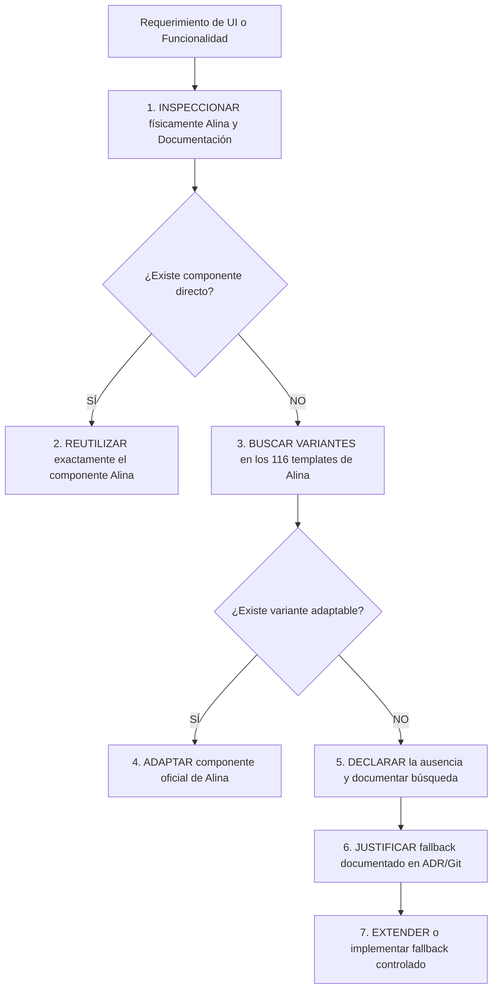

# 01 — Gobernanza de Proyecto y Reglas de Desarrollo

## 1. Declaración de Autoridad y Jerarquía Documental

1. **Prevalencia del Repositorio Local:** Los archivos físicos contenidos en `D:\laragon\www\app.casa-pro`, en especial la plantilla `admin-dashboard\alina\template` y su documentación `admin-dashboard\documentation`, constituyen la **única fuente de verdad** estética y de componentes UI. El conocimiento interno o memoria general de cualquier IA o desarrollador queda subordinado a los archivos locales.
2. **Inmutabilidad de la Plantilla Original:** La carpeta `admin-dashboard/` es una referencia técnica de **solo lectura**. Queda terminantemente prohibido alterar, editar, renombrar o mover archivos dentro de `admin-dashboard/`. El código del sistema CasaPRO se desarrolla en la raíz del proyecto (`app/`, `public/`, `config/`, etc.), copiando o adaptando los recursos necesarios hacia la estructura productiva.

---

## 2. La Regla Anti-Invención

Ningún agente o desarrollador tiene autorización para generar código HTML, estilos CSS, plugins JS o librerías de terceros basándose en suposiciones, tendencias genéricas de la web o hábitos de otros frameworks.

El flujo de trabajo es estricto e inviolable:



### Protocolo de Evidencia para Fallbacks:
Si un requerimiento legítimo de CasaPRO no tiene un componente equivalente en Alina (por ejemplo, validación declarativa avanzada sin jQuery tipo PristineJS):
1. **Inspeccionar:** Buscar en `admin-dashboard/alina/template/*.html` y `admin-dashboard/alina/assets/vendor/`.
2. **Declarar:** Documentar explícitamente qué archivos se inspeccionaron y qué se encontró.
3. **Justificar:** Explicar técnicamente por qué las opciones nativas de Alina son insuficientes para el caso de uso.
4. **Registrar ADR:** Crear o referenciar la Decisión Arquitectónica formal antes de introducir la librería externa.

---

## 3. Estructura de Roles y Agentes Especializados

Para garantizar la integridad y evitar modificaciones simultáneas contradictorias, el desarrollo se organiza en responsabilidades funcionales bien delimitadas.

```
AGENTE ORQUESTADOR / ARQUITECTO
│
├── Agente de Gobernanza (Control de normas, ADRs y checklist)
├── Agente de Arquitectura (Patrones de diseño, MVC, rutas y flujo)
├── Agente de Base de Datos (Esquemas, migraciones, integridad y tipos)
├── Agente Backend PHP (Servicios, repositorios, controladores y validación)
├── Agente Frontend / Alina (Inspección física de plantillas, ensamble UI, DataTables)
├── Agente Seguridad / RBAC (Autenticación, CSRF, permisos, scopes y sanitización)
├── Agente QA / Testing (Gates de calidad, validación cruzada y pruebas)
├── Agente Auditoría / Finanzas (Trazabilidad, inmutabilidad y consistencia)
└── Agente Documentación (Fichas, manuales, API specs y changelogs)
```

### Regla del Implementador Único:
- **Solo un agente a la vez** tiene la responsabilidad de modificar el código en una microfase específica.
- Los demás agentes actúan como revisores, validadores o auditores de la entrega antes de permitir el cierre del micro-baseline.

---

## 4. Política de Microfases y Micro-Baselines

1. **Alcance Acotado:** Cada microfase debe resolver una unidad funcional atómica, comprobable y verificable (e.g., *CRUD de Personas*, *Endpoint Server-side de DataTables*, *Apertura de Caja*).
2. **Prohibición de Cambios Mezclados:** Queda prohibido mezclar en una misma entrega cambios estructurales de base de datos con modificaciones de UI no relacionadas o refactorizaciones masivas.
3. **Flujo de Micro-Baseline:**
   - Partir de un baseline limpio verificado (`git status` limpio, pruebas pasando).
   - Ejecutar la microfase aplicando la regla anti-invención.
   - Ejecutar los gates de validación técnicos y funcionales.
   - Emitir el reporte de cumplimiento.
   - Realizar el commit atómico y establecer el nuevo micro-baseline.
