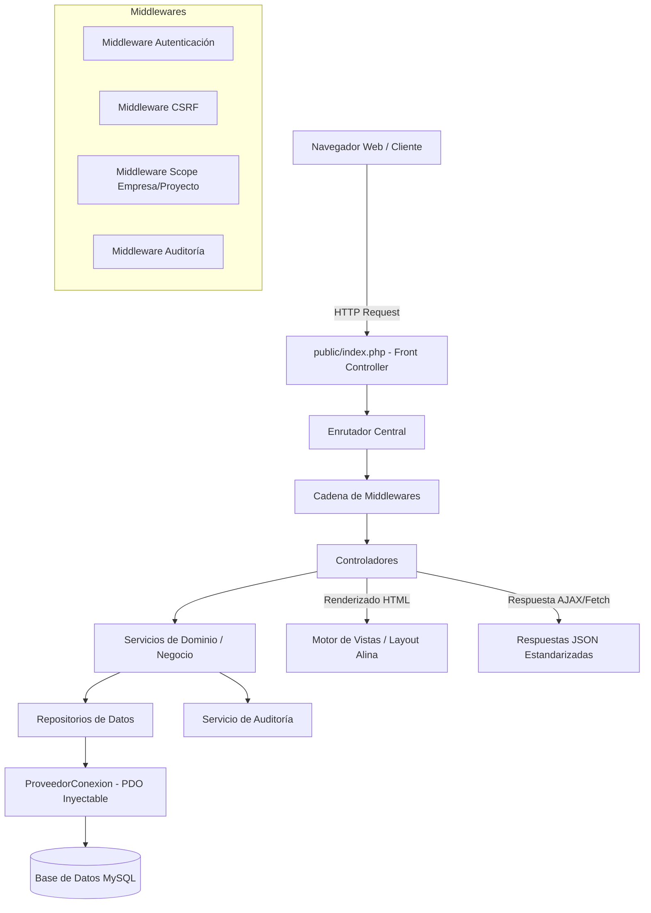

# 02 — Arquitectura del Sistema CasaPRO

## 1. Visión General Técnica

CasaPRO se construye como una plataforma web moderna, robusta y de alto rendimiento basada en **PHP 8.3 nativo**, implementando un patrón **MVC propio desacoplado**, sin la sobrecarga de frameworks monolíticos de terceros ni ORMs pesados.

### Decisiones Clave de Arquitectura:
- **Lenguaje:** PHP 8.3+ con tipado estricto (`declare(strict_types=1);`).
- **Base de Datos:** Motor relacional (MySQL/MariaDB en entorno Laragon local) consumido exclusivamente mediante **PDO** con sentencias preparadas nativas.
- **Sin ORM:** No se utiliza Eloquent ni Doctrine. Las consultas SQL son explícitas, optimizadas, seguras e indexadas en los Repositorios.
- **Frontend:** HTML5 semántico estructurado sobre el sistema de diseño **Alina Bootstrap 5**, JavaScript modular moderno (ES6+, Fetch API nativo, sin dependencias de jQuery para código nuevo del negocio) y PristineJS como fallback formalizado para validación.

---

## 2. Diagrama de Capas del Sistema



---

## 3. Estructura de Directorios del Proyecto

```text
D:\laragon\www\app.casa-pro\
├── admin-dashboard\            # [READ-ONLY] Plantilla original y documentación Alina
│   ├── alina\
│   └── documentation\
├── app\                        # Núcleo de la aplicación CasaPRO
│   ├── Controladores\          # Manejadores de solicitudes HTTP (web y API)
│   ├── Servicios\              # Lógica de negocio y reglas de dominio
│   ├── Repositorios\           # Capa de persistencia y consultas SQL PDO
│   ├── Modelos\                # Entidades del dominio y estructuras de datos
│   ├── DTOs\                   # Data Transfer Objects (validación y transporte)
│   ├── Middlewares\            # Filtros de seguridad, RBAC, CSRF y scopes
│   ├── Core\                   # Componentes base (Router, Request, Response, BD, Vista, Migrador)
│   └── Vistas\                 # Plantillas PHP basadas en el layout de Alina
│       ├── layouts\            # Layout maestro (blank.html adaptado), navbars, sidebars
│       ├── componentes\        # Componentes reutilizables (modales, cards, alerts)
│       └── modulos\            # Vistas específicas por módulo (personas, ventas, caja)
├── bin\                        # Herramientas de consola y CLI (migrador)
├── config\                     # Archivos de configuración (bd, app, auth, constantes)
├── SQL\                        # Esquema consolidado y migraciones oficiales
│   ├── casa-pro.sql            # Esquema consolidado oficial vigente
│   └── migraciones\            # Historial incremental secuencial
├── docs\                       # Paquete documental formal de gobernanza y arquitectura
├── public\                     # Raíz pública web (Front Controller y assets públicos)
│   ├── index.php               # Punto único de entrada
│   ├── .htaccess               # Reescritura de URLs limpias
│   └── assets\                 # CSS, JS, fuentes e imágenes copiados de Alina para producción
│       ├── css\
│       ├── js\
│       └── vendor\
├── storage\                    # Almacenamiento privado fuera del webroot
│   ├── logs\                   # Bitácoras del sistema y errores
│   ├── uploads\                # Archivos subidos (expedientes, documentos de clientes)
│   ├── temp\                   # Archivos temporales de exportación
│   └── cache\                  # Caché interno
├── .agents\                    # Skills, reglas y configuraciones del entorno agente
├── .gitignore                  # Reglas de exclusión para Git
└── CHANGELOG.md                # Registro cronológico de micro-baselines y versiones
```

---

## 4. Responsabilidades por Capa

### 4.1. Capa de Controladores (`app/Controladores/`)
- Recibe la solicitud HTTP encapsulada en un objeto `Peticion` (`Request`).
- Invoca la validación de entrada mediante DTOs o validadores.
- Invoca al Servicio de Dominio correspondiente.
- Retorna una `Respuesta` (`Response`) estructurada: vista HTML renderizada o JSON estándar.
- **Regla estricta:** Un controlador **jamás** ejecuta consultas SQL directamente ni contiene lógica de negocio compleja.

### 4.2. Capa de Servicios de Dominio (`app/Servicios/`)
- Concentra las reglas de negocio, cálculos de amortización, validaciones de saldo, transiciones de estado de lotes y flujos de aprobación.
- Gestiona transacciones de base de datos multientidad (`beginTransaction`, `commit`, `rollBack`).
- Dispara eventos de auditoría transversal tras operaciones críticas.

### 4.3. Capa de Repositorios (`app/Repositorios/`)
- Encapsula toda interacción con la base de datos a través de PDO.
- Escribe consultas preparadas con parámetros vinculados (`bindValue` / `bindParam`).
- Provee métodos atómicos: `buscarPorId()`, `guardar()`, `actualizar()`, `listarDataTables()`.
- Soporta paginación, ordenamiento y filtrado server-side para DataTables.

### 4.4. Capa de Vistas (`app/Vistas/`)
- Ensambla las páginas del sistema respetando la estructura física de `admin-dashboard\alina\template\blank.html`.
- Separa layout general (sidebar dinámico, header con usuario/notificaciones, footer) de las vistas específicas de cada pantalla.
- Toda salida variable se escapa adecuadamente (`htmlspecialchars`) para mitigar vulnerabilidades XSS.
