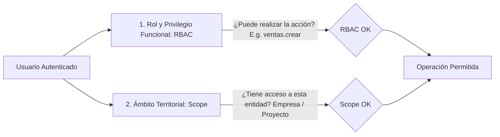

# 04 — Seguridad y Control de Acceso (RBAC & Scopes)

## 1. Principios de Seguridad

La seguridad en CasaPRO no es un añadido superficial, sino un requisito transversal no negociable (*Security by Design*). Toda funcionalidad debe ser verificada contra vectores de ataque comunes antes de ser promovida.

---

## 2. Modelo de Autorización: RBAC + Scopes Territoriales

El acceso a los recursos del sistema requiere la validación simultánea de dos dimensiones:



### 2.1. Dimensión Funcional (RBAC)
- **Roles:** Agrupaciones lógicas de privilegios (`Superadministrador`, `Gerente General`, `Jefe de Ventas`, `Asesor Comercial`, `Cajero`, `Jefe de Operaciones`, `Auditor`).
- **Privilegios Atómicos:** Claves específicas en formato `modulo.accion` (e.g., `personas.ver`, `personas.crear`, `personas.editar`, `ventas.aprobar`, `caja.cerrar`).
- **Independencia Menú vs Autorización:** La presencia o ausencia de un ítem en el menú es solo una conveniencia visual de navegación; la autorización real se valida en el backend en cada endpoint y controlador.

### 2.2. Dimensión Territorial (Scopes)
- **Alcance Global (`GLOBAL`):** Permite consultar y gestionar registros de todas las empresas y proyectos. Reservado para el Superadministrador corporativo y Auditores.
- **Alcance por Empresa (`EMPRESA`):** Restringe el acceso a los datos vinculados a la(s) empresa(s) asignada(s) al usuario (`usuario_empresas`).
- **Alcance por Proyecto (`PROYECTO`):** Restringe el acceso únicamente a los proyectos habilitados para el usuario (`usuario_proyectos`).
- **Alcance por Sector (`SECTOR`):** Restringe la visibilidad a sectores o etapas específicas de un proyecto.

---

## 3. Autenticación y Gestión de Sesiones

1. **Hash de Contraseñas:** Algoritmo nativo `PASSWORD_ARGON2ID` o `PASSWORD_BCRYPT` (factor de costo 12). Prohibido el uso de MD5, SHA1 o texto plano.
2. **Protección de Sesión:**
   - Regeneración de ID de sesión (`session_regenerate_id(true)`) al autenticarse y en cambios de privilegio para prevenir Session Fixation.
   - Configuración estricta de cookies de sesión:
     - `session.cookie_httponly = 1` (inmune a lectura JS).
     - `session.cookie_secure = 1` (obligatorio bajo HTTPS).
     - `session.cookie_samesite = 'Lax'` (mitigación CSRF).
3. **Control de Intentos Fallidos (Rate Limiting):** Bloqueo temporal de IP o cuenta tras 5 intentos fallidos consecutivos de inicio de sesión durante una ventana de 15 minutos.
4. **Cierre por Inactividad:** Expiración de sesión configurable tras 30 minutos de inactividad.

---

## 4. Protección contra Ataques Comunes

### 4.1. Inyección SQL (SQLi)
- **Regla Cero Tolerancia:** Ninguna consulta SQL se construye mediante concatenación o interpolación de cadenas de texto con datos de usuario.
- **Uso Exclusivo de Prepared Statements:**
  ```php
  $stmt = $pdo->prepare('SELECT id, nombres FROM personas WHERE numero_documento = :doc AND estado = :estado');
  $stmt->execute(['doc' => $numeroDoc, 'estado' => 'ACTIVO']);
  ```

### 4.2. Cross-Site Request Forgery (CSRF)
- Todo formulario HTML incluye un token CSRF criptográficamente seguro almacenado en sesión.
- Toda solicitud de modificación de estado (`POST`, `PUT`, `DELETE`, `PATCH`) es interceptada por el `CsrfMiddleware`.
- Las llamadas AJAX/Fetch envían el token en la cabecera HTTP `X-CSRF-TOKEN`.

### 4.3. Cross-Site Scripting (XSS)
- Todo dato variable impreso en vistas HTML se escapa usando `htmlspecialchars($valor, ENT_QUOTES | ENT_SUBSTITUTE, 'UTF-8')`.
- Cabeceras HTTP de seguridad obligatorias:
  - `Content-Security-Policy: default-src 'self' ...`
  - `X-Content-Type-Options: nosniff`
  - `X-Frame-Options: SAMEORIGIN`
  - `Referrer-Policy: strict-origin-when-cross-origin`

### 4.4. Carga Segura de Archivos (File Upload)
- Los archivos se almacenan en `storage/uploads/` (fuera del directorio accesible por web `public/`).
- La validación del tipo de archivo se realiza inspeccionando el contenido binario real (`finfo_file(FILEINFO_MIME_TYPE)`), nunca confiando en la extensión enviada por el navegador.
- Los nombres de archivo se reemplazan por identificadores generados (UUIDv7) para prevenir path traversal o colisiones.
- La descarga de archivos pasa por un controlador con validación de autenticación y permisos sobre el expediente.

---

## 5. Salvaguardas en Operaciones Financieras Críticas

1. **Bloqueo Concurrente y Transacciones:** Toda operación financiera multietapa (e.g., registro de venta y bloqueo de lote, cobro de cuota y actualización de saldo de caja) se ejecuta dentro de una transacción PDO con control de aislamiento.
2. **Re-autenticación para Operaciones de Alto Impacto:** Para anular contratos o realizar estornos de caja, se requiere la confirmación de la contraseña del usuario o token de doble autorización de supervisor.
3. **Inmutabilidad y No Eliminación:** Prohibición estricta de sentencias `DELETE` sobre tablas financieras (`pagos`, `cuotas`, `movimientos_caja`, `asientos_contables`). Toda corrección se efectúa mediante registros de contrapartida o cambio de estado con auditoría.
