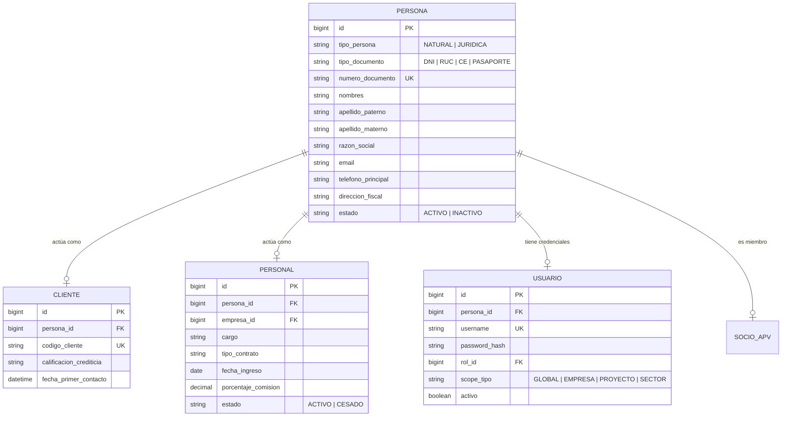
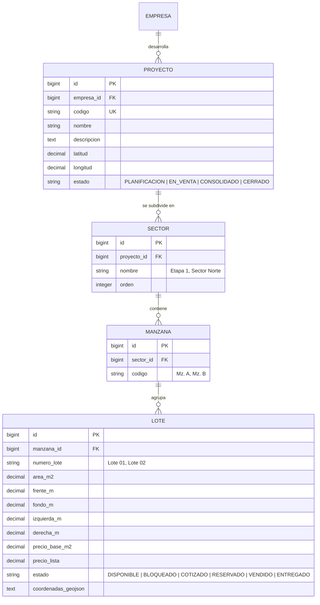
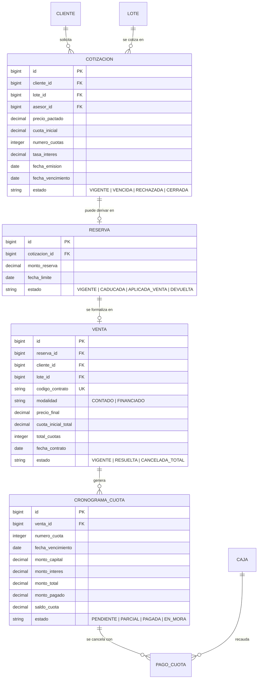

# 05 — Modelo de Dominio y Entidades

## 1. Identidad Central Desacoplada: Matriz Persona

El diseño del modelo de dominio de CasaPRO resuelve de raíz el error clásico de duplicar datos de personas en múltiples tablas. Se establece la entidad **Persona** como la raíz de identidad única del sistema:

### Reglas de Dominio de Identidad:
1. Si un cliente pasa a ser asesor de ventas (personal), se crea un registro en `personal` vinculado al mismo `persona_id`.
2. Si un asesor accede al software para ingresar visitas, se crea un registro en `usuarios` vinculado a su `persona_id`.
3. Los cambios de domicilio o teléfono de una persona se actualizan una sola vez y se reflejan instantáneamente en sus expedientes de cliente, usuario y personal.

---

## 2. Entidades Catastrales y Territoriales

---

## 3. Entidades Comerciales y Operaciones de Venta

---

## 4. Entidades Financieras y de Tesorería

- **Caja (`cajas`):** Puntos de recaudación físicos o lógicos (Caja Principal, Caja Caseta Proyecto A, BCP Recaudación).
- **Apertura y Cierre de Caja (`apertura_cierre_cajas`):** Registro de arqueo inicial, transacciones durante el turno y arqueo de balance de cierre por usuario cajero.
- **Movimiento de Caja (`movimientos_caja`):** Todo ingreso por cuotas, reservas o pagos varios, y egresos autorizados (viáticos, servicios de caseta).

---

## 5. Entidades de Postventa, Entrega y APV

- **Acta de Entrega (`actas_entrega`):** Documento formal con fecha, participantes, checklist de inspección y estado de posesión.
- **Ticket Postventa (`tickets_postventa`):** Solicitudes de atención por garantías de habilitación urbana (afirmado, hitos, conexiones de agua/luz) con seguimiento de estado (`ABIERTO`, `EN_PROCESO`, `ATENDIDO`, `CERRADO`).
- **Libro de Reclamaciones (`reclamaciones`):** Registro normativo oficial con código único correlativo por año, tipo (queja o reclamo), detalle y descargo documentado de la empresa.
- **APV (`apv_asociaciones`, `apv_socios`):** Gestión asociativa vecinal desacoplada de la empresa operadora para administración comunal.
