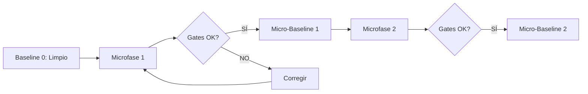

# 12 — Control de Versiones Git y Gestión de Micro-Baselines

## 1. El Concepto de Micro-Baseline

Un **micro-baseline** en CasaPRO es un estado congelado, verificado y completamente funcional del repositorio, alcanzado al término de una microfase una vez superados el 100% de los gates de calidad.

---

## 2. Reglas Estrictas de Gestión Git

1. **Prohibición de Commits Masivos:**
   - Queda terminantemente prohibido consolidar en un solo commit cambios pertenecientes a múltiples dominios o funcionalidades no relacionadas (e.g., *“Personas + Usuarios + Proyectos + Caja + cambios visuales”*).
   - Cada commit debe representar un cambio acotado, explicable en un solo párrafo y fácilmente reversible mediante `git revert`.
2. **Convención de Mensajes de Commit (Conventional Commits):**
   - `feat(personas): implementar validación de unicidad de DNI en repositorio`
   - `fix(auth): corregir expiración de cookie de sesión bajo HTTPS`
   - `docs(alina): registrar inventario físico de componentes en 07-UI-UX-ALINA`
   - `chore(db): agregar migración 000003 de estructura de tablas de roles`
3. **Etiquetado de Micro-Baselines:**
   - Al finalizar cada microfase y tras la aprobación de QA y Gobernanza, se creará un tag ligero:
     - `mb-fase0a-gobernanza`
     - `mb-fase0b-infraestructura`
     - `mb-fase1-personas-crud`
     - etc.

---

## 3. Protocolo de Cierre de Microfase

Antes de ejecutar el commit de cierre:
1. Ejecutar `git status` y verificar que no existan archivos residuales, logs temporales ni ficheros fuera de lugar.
2. Confirmar que los gates de `docs/11-PRUEBAS-Y-GATES.md` tienen dictamen unánime `PASS`.
3. Actualizar `CHANGELOG.md` con la descripción del micro-baseline alcanzado.
4. Efectuar el commit atómico y la etiqueta correspondiente.
