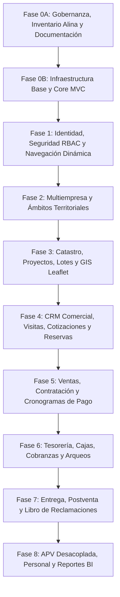

# 13 — Roadmap General de Implementación de CasaPRO

## 1. Estrategia de Progresión por Fases

El desarrollo de CasaPRO se ejecuta en microfases secuenciales estrictas, donde cada fase se asienta sobre la base sólida y verificada de la fase anterior.

---

## 2. Detalle de Fases y Entregables

### Fase 0A — Gobernanza y Arquitectura (Fase Actual)
- Inspección física real de la plantilla Alina, assets y documentación.
- Inventario completo de plugins, dependencias y estructura de `blank.html`.
- Paquete documental maestro en `docs/` (00 al 16 + CHANGELOG).
- Definición de 10 Agentes especializados y catálogo de 16 Skills propios.
- Inicialización de Git y establecimiento de `baseline-0`.

### Fase 0B — Infraestructura Mínima del Sistema
- Estructura productiva de carpetas (`app/`, `public/`, `config/`, `database/`, `storage/`).
- Core PHP 8.3: Enrutador (`Router`), `Peticion`, `Respuesta`, conexión Singleton PDO (`BaseDatos`).
- Mecanismo de Sesión segura y `CsrfMiddleware`.
- Adaptación del layout maestro Alina basado en `blank.html` con sistema de vistas y layouts.
- Pipeline de assets copiados de Alina a `public/assets/`.
- Endpoint de salud y primera pantalla base operativa.

### Fase 1 — Núcleo de Identidad, Personas y RBAC
- **Microfase 1A (Cerrada):** Persistencia, proveedor inyectable PDO, `.env` con phpdotenv, motor de migraciones y esquema oficial `SQL/casa-pro.sql` (`mb-fase1a-persistencia`).
- **Microfase 1B (Cerrada):** Modelo normalizado de identidad Persona (Natural/Jurídica), documentos, contactos, direcciones y catálogo UBIGEO vigente de CasaPRO (`mb-fase1b-identidad`).
- **Microfase 1C (Cerrada):** Actores de sistema, bitácora inmutable de auditoría forense append-only, sesiones estrictas y anti-CSRF con prohibición de bypass Bearer (`mb-fase1c-seguridad-auditoria`).
- **Microfase 1D (Cerrada):** Repositorio PDO, servicio transaccional, DTOs con allowlist estricta y API REST JSON protegida por Deny by Default (`mb-fase1d-api-personas`).
- **Microfase 1E (Cerrada):** Listado interactivo en Alina con DataTables 1.13.3 server-side con fetch nativo, búsqueda debounced, filtros rápidos y modal de Ficha de Identidad (`mb-fase1e-listado-personas`).
- **Normalización Visual Global (Cerrada):** Tipografía oficial Fira Sans, migración total a Font Awesome (erradicación de Tabler), tooltips Bootstrap delegados y Theme Customizer funcional (`mb-ui-normalizacion-global`).
- **Gobernanza CRUD Asíncrono (Cerrada):** Oficialización del patrón CRUD asíncrono en gobernanza, convenciones, skills, ADRs (ADR-023, ADR-024) y batería de gates G-CRUD-1 a G-CRUD-6 como prerrequisito normativo cumplido (`mb-gobernanza-crud-asincrono`).
- **Microfase 1F (Cerrada):** Alta, edición y transición de estados con formularios en modales Alina, CleaveJS, PristineJS, confirmaciones SweetAlert2, consulta asistida DNI/RUC desacoplada y sincronización asíncrona `tabla.ajax.reload(null, false)` (`mb-fase1f-crud-personas`, commit `76c7911`).
- **Microfase 1G-1 (Cerrada):** Núcleo de autenticación y autorización: modelo Usuario ↔ Persona (1:1), credenciales, hashing dinámico con rehash, login/logout, sesiones seguras con revocación inmediata por versión de autorización, mitigación de fuerza bruta con bloqueo defensivo temporal y ventana configurable, anti-enumeración de usuarios con telemetría técnica detallada (`eventos_seguridad`), Actor USER real e inmutable independiente del ID de usuario, rol raíz `SUPERADMIN` (ID 1), privilegios granulares `modulo.accion`, asignación Usuario ↔ Rol, semántica de ámbito territorial inicial `GLOBAL`, middlewares `AutenticacionMiddleware` y `AutorizacionMiddleware` con política universal Deny by Default, First Bootstrap soberano vía CLI (`bin/casapro-bootstrap-admin.php`) con orquestación transaccional y rechazo estricto de contraseñas por flags, y pantalla de inicio de sesión Alina adaptada (`sign_in.html`) con Vanilla JS, PristineJS y protección CSRF (`mb-fase1g1-autenticacion-rbac`).
- **Microfase 1G-2 (Pendiente):** Administración de usuarios y accesos: CRUD asíncrono de usuarios desde Persona Natural, asignación de roles y scopes, cambio de contraseña, bloqueo/desbloqueo administrativo y auditoría.
- **Microfase 1G-3 (Pendiente):** Gestión de Menú Dinámico y Navegación:
  - Generador / CRUD de menú dinámico con jerarquía máxima estricta de **3 niveles** (Nivel 1 $\rightarrow$ Nivel 2 $\rightarrow$ Nivel 3; Nivel 4+ prohibido).
  - Regla de Oro Inviolable: **`MENÚ ≠ AUTORIZACIÓN`**. El menú es una conveniencia visual de navegación; la autorización soberana reside en el backend.
  - Consumo directo de RBAC: referencia privilegios existentes (`modulo.accion`) sin duplicar tablas de permisos (`menu_permiso`, etc.).
  - Separación dimensional: RBAC (¿qué puede hacer?) vs Scope (¿dónde puede hacerlo?).
  - Modelo conceptual: nombre, descripción, icono (Font Awesome Free validado), ruta (no es identidad primaria), opción padre (agrupador vs enlace), nivel, orden persistido (drag/drop o controles Alina) y estado (`ACTIVO`/`INACTIVO`).
  - Integración nativa con `ul.navbar-menu-list` de Alina, tooltips Bootstrap automáticos por delegación, y CRUD asíncrono oficial CasaPRO con auditoría forense (`AuditoriaServicio` con Actor USER).
  - Dependencia lineal estricta: `1G-1 → 1G-2 → 1G-3`.

### Fase 2 — Estructura Multiempresa y Ámbitos Territoriales
- Gestión de `empresas` y asignación de usuarios a ámbitos corporativos (`usuario_empresas`).
- Selector de empresa/proyecto activo en el header superior.
- Filtrado territorial de entidades según el scope activo del actor.

### Fase 3 — Catastro, Lotes y Módulo GIS
- Jerarquía catastral: Proyectos $\rightarrow$ Sectores $\rightarrow$ Manzanas $\rightarrow$ Lotes.
- Registro detallado de lotes (linderos, metrajes, precios, coordenadas GeoJSON).
- Integración del mapa interactivo con Leaflet (nativo de Alina) para visualización en tiempo real del plano de lotes.

### Fase 4 — CRM Comercial e Inmobiliario
- Captación de prospectos y bitácora de visitas a terreno.
- Simulador de financiamiento y emisión de cotizaciones formales.
- Separación de lotes mediante reservas con pago de arras y expiración temporal.

### Fase 5 — Ventas, Contratación y Financiamiento
- Formalización de contratos de venta contado y financiado.
- Motor de cálculo de cronograma de pagos (cuotas fijas, amortización de capital e interés).
- Expediente digital del contrato y generación de documentos en PDF.

### Fase 6 — Tesorería, Cajas y Cobranzas
- Definición de cajas físicas y bancarias.
- Procesos diarios de apertura, movimientos, cobro de cuotas y arqueo de cierre de caja.
- Cálculo de penalidades y moras automatizadas; emisión de estados de cuenta.

### Fase 7 — Entrega, Postventa y Reclamaciones
- Flujo formal de entrega de lote con checklist de inspección y actas firmadas.
- Módulo de postventa con tickets de garantía y SLA de atención.
- Libro de Reclamaciones virtual con código correlativo normativo.

### Fase 8 — APV, RRHH y Reportería
- Módulo asociativo vecinal APV desacoplado (padrón, directiva, aportes vecinales).
- Registro de colaboradores, asistencia y liquidación de comisiones de venta.
- Cuadros de mando gerenciales y analítica comercial con ApexCharts.
