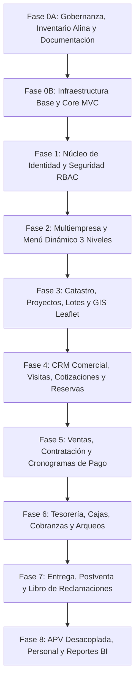

# 13 — Roadmap General de Implementación de CasaPRO

## 1. Estrategia de Progresión por Fases

El desarrollo de CasaPRO se ejecuta en microfases secuenciales estrictas, donde cada fase se asienta sobre la base sólida y verificada de la fase anterior.

---

## 2. Detalle de Fases y Entregables

### Fase 0A — Gobernanza y Arquitectura (Fase Actual)
- Inspección física real de la plantilla Alina, assets y documentación.
- Inventario completo de plugins, dependencias y estructura de `blank.html`.
- Paquete documental maestro en `docs/` (00 al 16 + CHANGELOG).
- Definición de 10 Agentes especializados y catálogo de 16 Skills propios.
- Inicialización de Git y establecimiento de `baseline-0`.

### Fase 0B — Infraestructura Mínima del Sistema
- Estructura productiva de carpetas (`app/`, `public/`, `config/`, `database/`, `storage/`).
- Core PHP 8.3: Enrutador (`Router`), `Peticion`, `Respuesta`, conexión Singleton PDO (`BaseDatos`).
- Mecanismo de Sesión segura y `CsrfMiddleware`.
- Adaptación del layout maestro Alina basado en `blank.html` con sistema de vistas y layouts.
- Pipeline de assets copiados de Alina a `public/assets/`.
- Endpoint de salud y primera pantalla base operativa.

### Fase 1 — Núcleo de Identidad, Personas y RBAC
- Migración y CRUD de `personas` (validación estricta de DNI/RUC).
- Autenticación: Login, Logout, control de sesión y rate limiting.
- Estructura RBAC: roles, privilegios atómicos y scopes territoriales.
- DataTables server-side con búsqueda y paginación para Personas.
- Servicio de Auditoría Transversal activo.

### Fase 2 — Estructura Multiempresa y Menú Dinámico
- Gestión de `empresas` y asignación de usuarios a ámbitos territoriales.
- Menú dinámico de 3 niveles almacenado en base de datos con filtrado automático por permisos de usuario.
- Selector de empresa/proyecto activo en el header superior.

### Fase 3 — Catastro, Lotes y Módulo GIS
- Jerarquía catastral: Proyectos $\rightarrow$ Sectores $\rightarrow$ Manzanas $\rightarrow$ Lotes.
- Registro detallado de lotes (linderos, metrajes, precios, coordenadas GeoJSON).
- Integración del mapa interactivo con Leaflet (nativo de Alina) para visualización en tiempo real del plano de lotes.

### Fase 4 — CRM Comercial e Inmobiliario
- Captación de prospectos y bitácora de visitas a terreno.
- Simulador de financiamiento y emisión de cotizaciones formales.
- Separación de lotes mediante reservas con pago de arras y expiración temporal.

### Fase 5 — Ventas, Contratación y Financiamiento
- Formalización de contratos de venta contado y financiado.
- Motor de cálculo de cronograma de pagos (cuotas fijas, amortización de capital e interés).
- Expediente digital del contrato y generación de documentos en PDF.

### Fase 6 — Tesorería, Cajas y Cobranzas
- Definición de cajas físicas y bancarias.
- Procesos diarios de apertura, movimientos, cobro de cuotas y arqueo de cierre de caja.
- Cálculo de penalidades y moras automatizadas; emisión de estados de cuenta.

### Fase 7 — Entrega, Postventa y Reclamaciones
- Flujo formal de entrega de lote con checklist de inspección y actas firmadas.
- Módulo de postventa con tickets de garantía y SLA de atención.
- Libro de Reclamaciones virtual con código correlativo normativo.

### Fase 8 — APV, RRHH y Reportería
- Módulo asociativo vecinal APV desacoplado (padrón, directiva, aportes vecinales).
- Registro de colaboradores, asistencia y liquidación de comisiones de venta.
- Cuadros de mando gerenciales y analítica comercial con ApexCharts.
