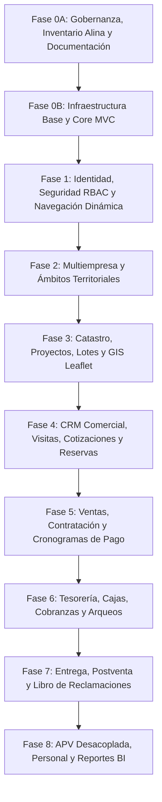

# 13 — Roadmap General de Implementación de CasaPRO

## 1. Estrategia de Progresión por Fases

El desarrollo de CasaPRO se ejecuta en microfases secuenciales estrictas, donde cada fase se asienta sobre la base sólida y verificada de la fase anterior.

---

## 2. Detalle de Fases y Entregables

### Fase 0A — Gobernanza y Arquitectura (Fase Actual)
- Inspección física real de la plantilla Alina, assets y documentación.
- Inventario completo de plugins, dependencias y estructura de `blank.html`.
- Paquete documental maestro en `docs/` (00 al 16 + CHANGELOG).
- Definición de 10 Agentes especializados y catálogo de 16 Skills propios.
- Inicialización de Git y establecimiento de `baseline-0`.

### Fase 0B — Infraestructura Mínima del Sistema
- Estructura productiva de carpetas (`app/`, `public/`, `config/`, `database/`, `storage/`).
- Core PHP 8.3: Enrutador (`Router`), `Peticion`, `Respuesta`, conexión Singleton PDO (`BaseDatos`).
- Mecanismo de Sesión segura y `CsrfMiddleware`.
- Adaptación del layout maestro Alina basado en `blank.html` con sistema de vistas y layouts.
- Pipeline de assets copiados de Alina a `public/assets/`.
- Endpoint de salud y primera pantalla base operativa.

### Fase 1 — Núcleo de Identidad, Personas y RBAC
- **Microfase 1A (Cerrada):** Persistencia, proveedor inyectable PDO, `.env` con phpdotenv, motor de migraciones y esquema oficial `SQL/casa-pro.sql` (`mb-fase1a-persistencia`).
- **Microfase 1B (Cerrada):** Modelo normalizado de identidad Persona (Natural/Jurídica), documentos, contactos, direcciones y catálogo UBIGEO vigente de CasaPRO (`mb-fase1b-identidad`).
- **Microfase 1C (Cerrada):** Actores de sistema, bitácora inmutable de auditoría forense append-only, sesiones estrictas y anti-CSRF con prohibición de bypass Bearer (`mb-fase1c-seguridad-auditoria`).
- **Microfase 1D (Cerrada):** Repositorio PDO, servicio transaccional, DTOs con allowlist estricta y API REST JSON protegida por Deny by Default (`mb-fase1d-api-personas`).
- **Microfase 1E (Cerrada):** Listado interactivo en Alina con DataTables 1.13.3 server-side con fetch nativo, búsqueda debounced, filtros rápidos y modal de Ficha de Identidad (`mb-fase1e-listado-personas`).
- **Normalización Visual Global (Cerrada):** Tipografía oficial Fira Sans, migración total a Font Awesome (erradicación de Tabler), tooltips Bootstrap delegados y Theme Customizer funcional (`mb-ui-normalizacion-global`).
- **Gobernanza CRUD Asíncrono (Cerrada):** Oficialización del patrón CRUD asíncrono en gobernanza, convenciones, skills, ADRs (ADR-023, ADR-024) y batería de gates G-CRUD-1 a G-CRUD-6 como prerrequisito normativo cumplido (`mb-gobernanza-crud-asincrono`).
- **Microfase 1F (Cerrada):** Alta, edición y transición de estados con formularios en modales Alina, CleaveJS, PristineJS, confirmaciones SweetAlert2, consulta asistida DNI/RUC desacoplada y sincronización asíncrona `tabla.ajax.reload(null, false)` (`mb-fase1f-crud-personas`, commit `76c7911`).
- **Microfase 1G-1 (Cerrada):** Núcleo de autenticación y autorización: modelo Usuario ↔ Persona (1:1), credenciales, hashing dinámico con rehash, login/logout, sesiones seguras con revocación inmediata por versión de autorización, mitigación de fuerza bruta con bloqueo defensivo temporal y ventana configurable, anti-enumeración de usuarios con telemetría técnica detallada (`eventos_seguridad`), Actor USER real e inmutable independiente del ID de usuario, rol raíz `SUPERADMIN` (ID 1), privilegios granulares `modulo.accion`, asignación Usuario ↔ Rol, semántica de ámbito territorial inicial `GLOBAL`, middlewares `AutenticacionMiddleware` y `AutorizacionMiddleware` con política universal Deny by Default, First Bootstrap soberano vía CLI (`bin/casapro-bootstrap-admin.php`) con orquestación transaccional y rechazo estricto de contraseñas por flags, y pantalla de inicio de sesión Alina adaptada (`sign_in.html`) con Vanilla JS, PristineJS y protección CSRF (`mb-fase1g1-autenticacion-rbac`).
- **Microfase 1G-2 (Cerrada):** Administración de usuarios, accesos y contraseñas: módulo independiente `/usuarios`, vinculación estricta 1:1 con Persona Natural (bloqueo a Persona Jurídica), CRUD asíncrono de cuentas, sincronización de roles, política soberana de contraseñas (`PoliticaContrasenaServicio`), cambio obligatorio de contraseña (`debe_cambiar_password`), aislamiento soberano por BD en `AutenticacionMiddleware`, reseteo administrativo con generación temporal y revocación de sesiones concurrentes (`version_autorizacion++`), cambio personal con validación criptográfica de `password_actual` y renovación de sesión activa sin auto-expulsión, desacoplamiento estricto entre estado administrativo (`ACTIVO`/`INACTIVO`) y bloqueo defensivo (`bloqueado_hasta`), desbloqueo administrativo independiente (`usuarios.desbloquear`), protección de jerarquía y anti-orfandad del último SUPERADMIN activo, prohibición de auto-desactivación y auto-reset, Ficha de Seguridad con timeline de telemetría y auditoría forense append-only (`mb-fase1g2-usuarios-accesos`).
- **Microfase 1G-3 (Cerrada):** Gestión de Menú Dinámico y Navegación:
  - Generador / CRUD de menú dinámico con jerarquía máxima estricta de **3 niveles** (Nivel 1 $\rightarrow$ Nivel 2 $\rightarrow$ Nivel 3; Nivel 4+ prohibido).
  - Regla de Oro Inviolable: **`MENÚ ≠ AUTORIZACIÓN`**. El menú es una conveniencia visual de navegación; la autorización soberana reside en el backend (HTTP 403 innegociable vía Middleware).
  - Consumo directo de RBAC: referencia privilegios existentes (`modulo.accion`) con FK `ON DELETE RESTRICT`, sin duplicar tablas de permisos (`menu_permiso`, etc.).
  - Separación dimensional: RBAC (¿qué puede hacer?) vs Scope (¿dónde puede hacerlo?).
  - Modelo conceptual y persistencia: tabla `menu_opciones` (Migración `2026_09_30_000009_crear_tabla_menu_opciones.sql`), código canónico, etiqueta, tipo (`AGRUPADOR`/`ENLACE`), icono Font Awesome Free validado, ruta interna estricta, opción padre, orden determinista normalizado $1..N$ en PHP/PDO (cero variables `@seq`), y estado (`ACTIVO`/`INACTIVO`).
  - Algoritmo de poda Fail-Closed y poda de ramas vacías (Bottom-Up) ante privilegios inconsistentes o revocados.
  - Reordenamiento jerárquico masivo con transacción atómica, prevención de ciclos directos e indirectos, y rollback integral.
  - Integración visual en Alina: botonera vertical y navegación lateral `navegacion-lateral.php`, contenedor `.list-group.nested-sortable` con `Sortable.min.js`, modales Bootstrap 5, SweetAlert2 y Fetch ES6+ nativo (cero `$.ajax()` propio).
  - Dependencia lineal estricta: `1G-1 → 1G-2 → 1G-3` (`mb-fase1g3-menu-dinamico`).

### Fase 2 — Estructura Multiempresa y Ámbitos Territoriales
- **Microfase 2A (Cerrada):** Dominio de Empresas y Vinculación Corporativa:
  - Extensión operativa de Persona Jurídica (`1 : 0..1`), persistencia tabla `empresas` (Migración `2026_09_30_000010_crear_tabla_empresas.sql`), código canónico inmutable, `nombre_corto` operativo y estado (`ACTIVO`/`INACTIVO`).
  - No duplicación de RUC, razón social ni datos civiles de Persona.
  - Orquestación transaccional con `PersonaServicio` (propietario único de transacción y rollback total).
  - Semántica de estados y errores: 422 (Persona Natural o Jurídica Inactiva), 409 (Duplicidad Persona-Empresa o Código corporativo existente).
  - Inmutabilidad de `persona_id` y `codigo`; empresa inactiva consultable históricamente; inexistencia deliberada de método `eliminar()`.
  - 4 Privilegios de catálogo (`empresas.ver`, `empresas.crear`, `empresas.editar`, `empresas.cambiar_estado`) y asignación a SUPERADMIN (`mb-fase2a-dominio-empresas`).
- **Microfase 2B (Cerrada):** Asignaciones Usuario ↔ Empresa y Scopes Territoriales:
  - Persistencia soberana en tabla 28 `usuario_empresa_roles` (Migración `2026_09_30_000011_crear_asignaciones_usuario_empresa_roles.sql`).
  - Separación de tuplas: `usuario_roles` para roles verdaderamente globales (`SUPERADMIN`) y `usuario_empresa_roles` (`usuario_id`, `empresa_id`, `rol_id`) para roles territoriales por empresa.
  - Origen exclusivo del contexto web: sesión del servidor (`$_SESSION['contexto_empresa_id']`). `X-Empresa-ID` y parámetros del cliente tratados como no confiables.
  - Gate Anti-IDOR / Anti-Tampering innegociable: Si el cliente envía `empresa_id` por GET, POST o JSON y difiere de la sesión activa, se deniega inmediatamente con HTTP 403 Forbidden y telemetría de seguridad.
  - Matriz semántica de respuestas HTTP: 401 (sin sesión), 403 (discordancia territorial o falta de privilegio RBAC), 404 (empresa inexistente), 409 (ausencia de contexto o empresa inactiva), 422 (validación/DTO o asignación de SUPERADMIN en empresa).
  - SUPERADMIN con bypass universal funcional condicionado a empresa activa (`fail-closed` si la empresa está inactiva).
  - Inmutabilidad y cero DELETE físico en BD: bajas lógicas mediante conmutación de estado (`ACTIVO`/`INACTIVO`), `revocado_por`, `revocado_en`, trazabilidad de actores vinculada a `actores(id)` con `ON DELETE RESTRICT`.
  - Incremento selectivo de `version_autorizacion` a nivel de usuario individual ante asignación, revocación o reactivación; invalidación en memoria de caché de autorización.
  - 4 Privilegios de catálogo (`asignaciones.ver`, `asignaciones.crear`, `asignaciones.editar`, `asignaciones.revocar`) vinculados a `SUPERADMIN` (`mb-fase2b-asignaciones-scopes`).
- **Microfase 2C (Cerrada):** Administración Web de Empresas:
  - Módulo web `/empresas` basado en Alina Bootstrap 5 (`blank.html` + `data_table.html` + `modals.html`).
  - DataTables server-side con adaptador `window.fetch()` nativo, ordenamiento seguro por whitelist y búsqueda multi-campo.
  - Migración `000012` (`2026_09_30_000012_sembrar_menu_empresas.sql`): siembra de nodos `GRP_EMPRESAS` (ID 8) y `OPC_EMPRESAS_LISTADO` (ID 9) en `menu_opciones` vinculados a `empresas.ver` sin IDs mágicos. Siguiente ranura libre: `000013`.
  - Modal de alta dual con pestañas: Modalidad vinculada (Select2 asistido sobre `/api/empresas/personas-juridicas-disponibles`) y Modalidad orquestada (contrato integral `CrearPersonaDTO` con RUC, SUNAT asistido, Domicilio Fiscal con cascada UBIGEO de 3 niveles, contactos institucionales y rollback transaccional total ante fallos).
  - Modal de edición inmutable: `persona_id` y `codigo` bloqueados/inmutables por gobernanza; mutación exclusiva de `nombre_corto`.
  - Conmutación asíncrona de estado mediante PATCH `/api/empresas/{id}/estado` con diálogo de confirmación SweetAlert2.
  - Ficha 360° veraz sustentada en el padrón central (datos de empresa, identidad jurídica, domicilios, contactos y representantes legales; cero campos inventados).
  - Cero `location.reload()` / `window.location.reload()`, recarga de DataTables vía `tabla.ajax.reload(null, false)`.
  - Cero llamadas a `$.ajax()` en código propio de CasaPRO (jQuery exclusivo para plugins DataTables/Select2 de Alina).
  - Cero métodos ni rutas DELETE físicas (inmutabilidad empresarial y ciclo de vida por estado).
  - Trazabilidad y auditoría forense append-only con Actor USER real (`mb-fase2c-administracion-empresas`).
- **Microfase 2D (Cerrada):** Selector Corporativo / Contexto Activo en Topbar y Conmutación en Caliente:
  - Cero DDL (0 migraciones consumidas, ranura `000013` permanece libre e intacta).
  - Selector interactivo responsive en barra superior (`barra-superior.php`) basado en Alina (`blank.html`), con dropdown interactivo Bootstrap 5 (`data-bs-toggle="dropdown"`, cero doble toggle en activador), badges contextuales con tooltips oficiales (`data-bs-toggle="tooltip"` y `data-bs-title`), y soporte dual desktop (nombre corto truncado) y móvil (código corporativo compacto).
  - MVC desacoplado estricto: `barra-superior.php` y `Vista.php` libres de acoplamiento al dominio Empresa (cero instanciación de repositorios o `AutorizacionServicio` en la vista ni en el motor genérico de vistas). Inyección orquestada en `BaseControlador` mediante `ContextoServicio::obtenerDatosParaLayout()`.
  - Orden canónico determinista en repositorios y servicios: `ORDER BY e.codigo ASC, e.nombre_corto ASC, e.id ASC`.
  - Sesión única como fuente de verdad territorial: `$_SESSION['contexto_empresa_id']` exclusiva (cero duplicación de nombres ni códigos corporativos en sesión).
  - Auto-selección determinista canónica en login (`AutenticacionServicio::autenticar()` paso 9) para usuarios con asignaciones o SUPERADMIN, y `null` para usuarios huérfanos.
  - Endpoints REST `/api/contexto/empresas` (GET) y `/api/contexto/cambiar-empresa` (POST) protegidos por `AutenticacionMiddleware` y CSRF.
  - Conmutación en caliente en `ContextoServicio::cambiarEmpresa()` con 5 factores de validación: autenticación activa + token CSRF + validación DTO estricta (`CambiarContextoEmpresaDTO`) + empresa `ACTIVO` en BD + pertenencia territorial activa en BD (`puedeAccederEmpresa`).
  - Blindaje preventivo de contextos subordinados: eliminación atómica de `contexto_proyecto_id` y `contexto_sector_id` al conmutar de empresa (preparación para Fase 3).
  - Gate Anti-IDOR multifuente reforzado en `ScopeMiddleware`: inspección simultánea de Query String, cuerpo POST y Payload JSON con rechazo estricto HTTP 403 Forbidden y telemetría de seguridad.
  - Detección en caliente de empresa inactivada en BD (HTTP 409 Conflict y desalojo de sesión).
  - Detección en caliente de revocación de asignación territorial por incremento de `version_autorizacion` (HTTP 401 Unauthorized y desalojo de sesión).
  - Frontend interactivo Vanilla JavaScript ES6+ (`public/assets/js/nucleo/selector-empresa.js`) con `window.fetch()`, buscador en tiempo real dentro del dropdown, diálogo de confirmación SweetAlert2 y recarga limpia de página documentada como excepción arquitectónica de conmutación de ámbito (`mb-fase2d-selector-corporativo`).
- **Cierre Complementario Fase 2 (Cerrado):** Gestión Visual de Asignaciones Territoriales (Usuario ↔ Empresa ↔ Rol):
  - Cero DDL (0 migraciones consumidas, ranura `000013` libre e intacta, `SQL/casa-pro.sql` inalterado).
  - Persistencia de 28 tablas, 239 columnas, 122 índices y 34 FKs preservada íntegra.
  - Reutilización estricta de los 4 privilegios RBAC existentes de 2B (`asignaciones.ver`, `asignaciones.crear`, `asignaciones.editar`, `asignaciones.revocar`) con cero privilegios inventados.
  - Ficha de Usuario (`/usuarios/{id}`): Pestaña Alina `Ámbitos Territoriales` (`#tab-territorial`) integrada con subnavegación `nav-bottom-line`.
  - Grilla interactiva de 1 fila por tupla canónica `(Usuario, Empresa, Rol)` con ordenamiento determinista por `codigo` corporativo, `nombre_corto` y `rol_id`.
  - Diálogo modal Alina Bootstrap 5 (`#modalAsignarRolEmpresa`) con Select2 para selección asistida de Empresa y Rol.
  - Filtro estricto de roles: exclusión de `SUPERADMIN` en el dropdown del frontend y rechazo obligatorio en backend con HTTP 422 Unprocessable Content.
  - Soporte de múltiples roles por empresa para el mismo usuario sin colisiones ni duplicaciones.
  - Conmutación asíncrona de estado (Revocar/Reactivar) con diálogo de confirmación SweetAlert2 y refresco dinámico de grilla sin recarga completa de página (`cero location.reload()`).
  - Reactivación atómica de tuplas históricas inactivas preexistentes: reutilización del mismo registro en `usuario_empresa_roles`, sin duplicidad de tuplas y reseteando `revocado_por` / `revocado_en` a NULL.
  - Inmutabilidad y cero DELETE físico en base de datos.
  - Invalidación en caliente de sesiones activas: incremento automático y atómico de `version_autorizacion` ante asignación, revocación y reactivación.
  - Trazabilidad y auditoría forense completa en tabla `auditorias` (`ASIGNAR_ROL_EMPRESA`, `REVOCAR_ROL_EMPRESA`, `REACTIVAR_ROL_EMPRESA`).
  - Ficha 360° de Empresa (`/empresas`): Pestaña Alina `Colaboradores Asignados` (`#tab-ficha-colaboradores-pane`) de solo lectura/auditoría (cero mutaciones territoriales desde Empresa).
  - Controlador REST `App\Controladores\AsignacionTerritorialControlador` y módulo JavaScript Vanilla ES6+ `public/assets/js/modulos/usuarios/asignaciones-territoriales.js`.
  - Suite de pruebas exhaustiva de 12 bloques y 62 aserciones al 100% PASS (`mb-fase2-cierre-asignaciones-visuales`).

### Fase 3 — Catastro, Lotes y Módulo GIS
- **Definiciones Conceptuales Homologadas y Congeladas (Baseline para Especificación Técnica):**
  - **Proyecto vs APV Desacoplados:** Entidad `proyectos` con `tipo_proyecto` (`PROPIO`, `CONVENIO_APV`, `ASOCIATIVO`). Desacoplamiento total: la APV es una entidad civil/asociativa (`personas` jurídica) vinculada opcionalmente (`persona_asociativa_id` nullable), sin forzar campos vecinales en proyectos propios ni duplicar modelos.
  - **Matriz de Precios y Moneda Soberana:**
    - Precios base por m² versionados históricamente a nivel de Sector (`precio_m2_base` con `DECIMAL(12,4)`).
    - Ajustes de precio por lote configurables (`ajustes_precio_lote` para esquinas, frente a parque, avenidas).
    - Congelación inmutable del precio final en la operación comercial.
    - Moneda soberana a nivel de Proyecto (PEN/USD), con montos finales en `DECIMAL(14,2)`.
  - **Manzanas y Lotes con Código y Orden Determinista:**
    - `codigo VARCHAR(20)` y `orden INT UNSIGNED`.
    - Unicidad contextual estricta `(sector_id, codigo)` para Manzanas y `(manzana_id, codigo)` para Lotes.
  - **Separación de Estado Catastral vs Estado Comercial:**
    - `estado_catastral` (`ACTIVO`, `BLOQUEADO_TECNICO`, `INACTIVO` con motivo auditable).
    - `estado_comercial` (`DISPONIBLE`, `RESERVADO`, `VENDIDO`), con acta de entrega formal gobernada en la operación comercial posterior.
- **Alcance Operativo de Fase 3:**
  - Jerarquía catastral territorial: Empresa $\rightarrow$ Proyectos $\rightarrow$ Sectores $\rightarrow$ Manzanas $\rightarrow$ Lotes.
  - Registro detallado de lotes (linderos, metrajes, precios, coordenadas GeoJSON).
  - Integración del mapa interactivo con Leaflet (nativo de Alina) para visualización en tiempo real del plano de lotes.

### Fase 4 — CRM Comercial e Inmobiliario
- Captación de prospectos y bitácora de visitas a terreno.
- Simulador de financiamiento y emisión de cotizaciones formales.
- Separación de lotes mediante reservas con pago de arras y expiración temporal.

### Fase 5 — Ventas, Contratación y Financiamiento
- Formalización de contratos de venta contado y financiado.
- Motor de cálculo de cronograma de pagos (cuotas fijas, amortización de capital e interés).
- Expediente digital del contrato y generación de documentos en PDF.

### Fase 6 — Tesorería, Cajas y Cobranzas
- Definición de cajas físicas y bancarias.
- Procesos diarios de apertura, movimientos, cobro de cuotas y arqueo de cierre de caja.
- Cálculo de penalidades y moras automatizadas; emisión de estados de cuenta.

### Fase 7 — Entrega, Postventa y Reclamaciones
- Flujo formal de entrega de lote con checklist de inspección y actas firmadas.
- Módulo de postventa con tickets de garantía y SLA de atención.
- Libro de Reclamaciones virtual con código correlativo normativo.

### Fase 8 — APV, RRHH y Reportería
- Módulo asociativo vecinal APV desacoplado (padrón, directiva, aportes vecinales).
- Registro de colaboradores, asistencia y liquidación de comisiones de venta.
- Cuadros de mando gerenciales y analítica comercial con ApexCharts.
